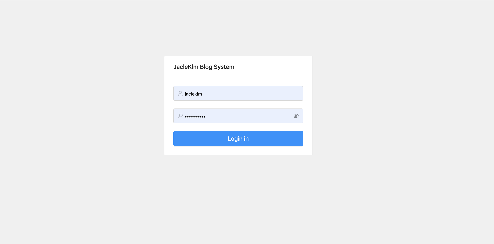
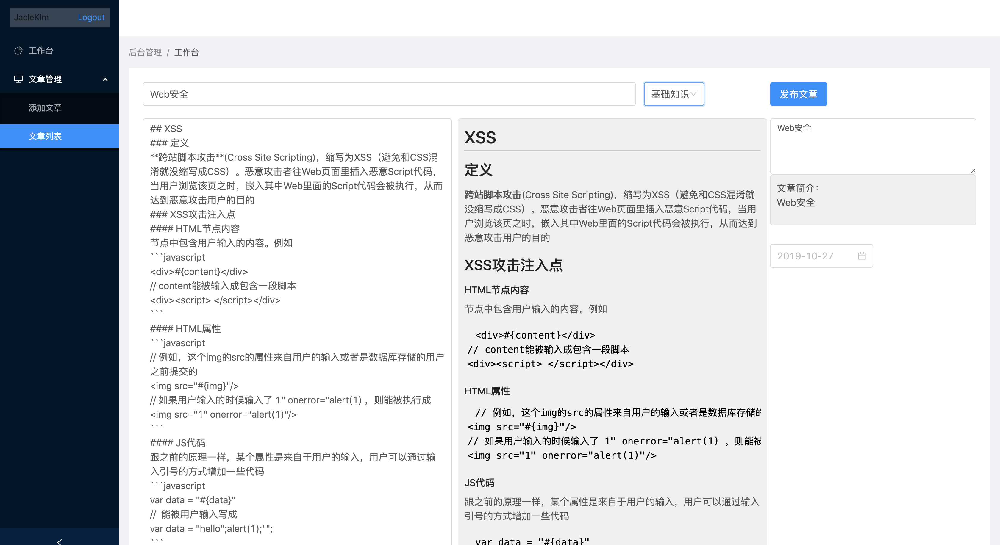

# admin
React-blog博客项目的后台管理系统，基于React + Antd 。从 UI 和 功能上目前还比较简单，后续会陆续优化

## 项目截图
#### 登录页

#### 添加文章页

#### 文章列表页


## 技术栈
* `React`： 项目开发
* `React-router`: 多页面之间的路由
* `Ant Design`：项目UI组件

## 实现的功能
#### 登录页
- [x] 登录
#### 添加文章页
- [x] 添加文章
- [x] 修改文章
#### 文章列表页
- [x] 查看文章列表
- [x] 删除文章
- [x] 点击修改文章会跳转到有文章内容的添加文章页

## 项目优化计划
- [ ] 登录账号和密码加密
- [ ] 实现手机号注册？或者说这种管理中台一般是管理者才能使用，管理者账号直接写在数据库就行了，不必要有注册功能
- [ ] 页面 UI 优化，使该系统美观一些
- [ ] 添加文章能插入图片

## 使用方法

``` bash
# 克隆到本地
git clone git@github.com:Jacleklm/admin.git

# 定位到该文件夹
cd admin

# 安装依赖
npm install

# 运行。会打开本地的3001端口，访问 http://localhost:3001 即可查看。在此之前需要先运行博客项目的数据中台
npm run dev

# 生成打包代码
npm run build
```


